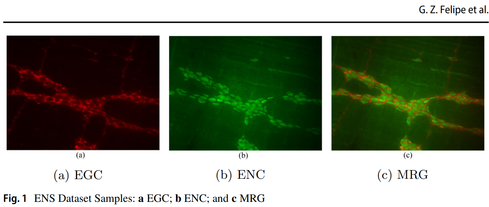

# The ENS-Z datasets 
[![CC BY-NC-SA 4.0][cc-by-nc-sa-shield]][cc-by-nc-sa]

This repository makes available the datasets used throught the development of the work described in [Cancer Identification in Enteric Nervous System Preclinical Images Using Handcrafted and Automatic Learned Features](https://doi.org/10.1007/s11063-022-11114-y), published to Neural Processing Letters.

## Abstract
Chronic degenerative diseases affect Enteric Neuron Cells (ENC) and Enteric Glial Cells (EGC) in shape and quantity. Thus, searching for automatic methods to evaluate when these cells are affected is quite opportune. In addition, preclinical imaging analysis is outstanding because it is non-invasive and avoids exposing patients to the risk of death or permanent disability. We aim to identify a specific cancer experimental model (Walker-256 tumor) in the Enteric Nervous System (ENS) cells. The ENS image database used in our experimental evaluation comprises 1248 images taken from thirteen rats distributed in two classes: control/healthy or sick. The images were created with three distinct contrast settings targeting different ENS cells: ENC, EGC, or both. We extracted handcrafted and non-handcrafted features to provide a comprehensive classification approach using SVM as the core classifier. We also applied Late Fusion techniques to evaluate the complementarity between feature sets obtained in different scenarios. In the best case, we achieved an F1-score of 0.9903 by combining classifiers built from different image types (ENC and EGC), using Local Phase Quantization (LPQ) features.

## Details
The ENS dataset contains image samples from the ENS of rats, specifically the jejunum, i.e., the second part of the small intestine of male adult Wistar rats (Rattus norvegicus, albius variety), with two classes: sick animals with cancer (TW) and control animals (C). Images were obtained from thirteen different animals, seven from the C class e six from the TW class. Each animal has 32 image samples obtained from the myenteric plexus. There are three distinct visualizations for each image sample: (1) EGC cells, (2) ENC cells, and (3) EGC and ENC cells merged (MRG), in which both cells are visible. Figure 1 shows some database image samples. In total, the dataset contains 1248 images. It is worth mentioning that all of them are in the PNG file format and have dimensions equivalent to 1384x1036 pixels.



The proposed dataset was obtained by researchers from the Enteric Neural Plasticity Laboratory of the State University of Maringá (UEM). The current dataset is a direct extension of one of the datasets presented in our [previous work](https://link.springer.com/article/10.1007/s00521-021-06164-7). In this one, we included two different versions for each image sample, differing by the type of cells highlighted: (1) ENC and (2) both cell types (i.e., MRG = EGC and ENC).

While building classifiers with the datasets, one should keep under consideration:
* The images are obtained from random samples extracted from the animal's small intestine, not representing any kind of observable continuity or correlation. Thus, using images from the same animal while training and testing should not represent any kind of data leakage. But, to ensure the model's correctiness **we recommend to always keep the images from one source animal together in the same split**
* Since each image samples has three distinct visualizations (ENC, EGC and MRG), multi-modal classification may be applied to this task as well as different ways to combine the data (e.g., early and late fusion). But, it is worth mentioning the information contained in these images may be redundant. Mainly when dealing with MRG samples, for being a combination of ENC and EGC
* Additionally, the use of **the leave-one-out cross-validation method is encouraged**, i.e. each fold is composed exclusively by one animal's image samples

## Data Organization
The overall data organization is described as follows:

- `data/raw`: image files as collected by the Enteric Neural Plasticity Laboratory researchers
- `data/interim`: CSV files containing the file paths and additional useful information for training ML/DL models, such as: animal tag (str), animal tag ID (int) and label (int)
- `data/processed/dataset_gs`: image files already converted to grayscale following the protocol described on our paper. To further understand time images' organization and the information present in their filenames, please refer to `data\processed\README.txt`
- `data/processed/fold_maps`: text files containing the filenames of the image samples for each fold (leave-one-out cross validation)
- `data/data_count.txt`: file containing the total number of image samples per animal and dataset. Could be used as a *"checksum"* when loading the dataset
- `features`: features extracted from the ENS-Z image samples. Every column (except the last one) represent a feature. The last column contains the image sample name. ***Note***: files are not split into train/test;
- `features/libsvm_format`: same as the previous item, but files are in the expected LibSVM library input format: the first column contains an integer representing the sample class and all of the remaining columns are the enumerated features. ***Note***: files are already split into train/test


## Citation
Whenever using the here available data, remember to cite the original paper:
```
@article{felipe_cancer_2022,
	title = {Cancer Identification in Enteric Nervous System Preclinical Images Using Handcrafted and Automatic Learned Features},
	author = {
      Felipe, Gustavo Z.
        and Teixeira, Lucas O.
        and Pereira, Rodolfo M.
        and Zanoni, Jacqueline N.
        and Souza, Sara R. G.
        and Nanni, Loris
        and Cavalcanti, George D. C.
        and Costa, Yandre M. G.},
	issn = {1573-773X},
	url = {https://doi.org/10.1007/s11063-022-11114-y},
	doi = {10.1007/s11063-022-11114-y},
	journal = {Neural Processing Letters},
	month = dec,
	year = {2022},
}
```

## Additional Notes
1. <span style="color:red">***IMPORTANT***</span>: This is still an ongoing project. Keeping that under consideration, at this moment, all of the extracted features will be shared instead of the raw image samples. Such images will be committed to the main branch as soon as the final paper is published
2. The source code developed for this project is publically available at: https://github.com/gustavozf/PRZ_3M
3. Please check out our [previous dataset (EGC-Z)](https://github.com/gustavozf/EGC_Z_dataset) if you are interest into developing projects with Enteric Nervous System images

## License 
This work is licensed under the [Creative Commons Attribution-NonCommercial-ShareAlike 4.0 International License][cc-by-nc-sa].

That means that you can:
* **Share** — copy and redistribute the material in any medium or format
* **Adapt** — remix, transform, and build upon the material

under the following terms:
* **Attribution** — You must give appropriate credit, provide a link to the license, and indicate if changes were made. You may do so in any reasonable manner, but not in any way that suggests the licensor endorses you or your use.
* **NonCommercial** — You may not use the material for commercial purposes.
* **ShareAlike** — If you remix, transform, or build upon the material, you must distribute your contributions under the same license as the original.

[![CC BY-NC-SA 4.0][cc-by-nc-sa-image]][cc-by-nc-sa]

[cc-by-nc-sa]: http://creativecommons.org/licenses/by-nc-sa/4.0/
[cc-by-nc-sa-image]: https://licensebuttons.net/l/by-nc-sa/4.0/88x31.png
[cc-by-nc-sa-shield]: https://img.shields.io/badge/License-CC%20BY--NC--SA%204.0-lightgrey.svg
